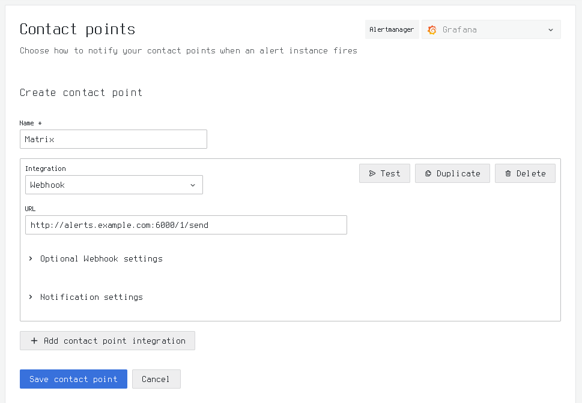

garriga
===

[](http://search.maven.org/#search%7Cga%7C1%7Cg%3A%22com.io7m.garriga%22)
[](https://s01.oss.sonatype.org/content/repositories/snapshots/com/io7m/garriga/)
[](https://codecov.io/gh/io7m-com/garriga)


| JVM | Platform | Status |
|-----|----------|--------|
| OpenJDK (Temurin) Current | Linux | [](https://www.github.com/io7m-com/garriga/actions?query=workflow%3Amain.linux.temurin.current)|
| OpenJDK (Temurin) LTS | Linux | [](https://www.github.com/io7m-com/garriga/actions?query=workflow%3Amain.linux.temurin.lts)|
| OpenJDK (Temurin) Current | Windows | [](https://www.github.com/io7m-com/garriga/actions?query=workflow%3Amain.windows.temurin.current)|
| OpenJDK (Temurin) LTS | Windows | [](https://www.github.com/io7m-com/garriga/actions?query=workflow%3Amain.windows.temurin.lts)|

## garriga

A [Grafana](https://grafana.com/) webhook used to allow posting alert
messages to a [Matrix](https://matrix.org/) channel.

## Features

* Post Grafana alerts to a Matrix channel.
* [OSGi-ready](https://www.osgi.org/)
* [JPMS-ready](https://en.wikipedia.org/wiki/Java_Platform_Module_System)
* ISC license.

## Usage

Provide a configuration file providing the various required details. For
example, assume the following content in a file named `config.json`:

```
{
  "%schema": "urn:com.io7m.garriga:configuration:1",

  "HTTPServer": {
    "ListenAddress": "::",
    "ListenPort": 6000
  },

  "MatrixClient": {
    "BaseURI": "https://matrix.example.com",
    "User": "@alerts:matrix.example.com",
    "Password": "changeit",
    "Channel": "#alerts:matrix.example.com"
  }
}
```

Run `garriga server --configuration-file config.json`. The server will
bind to all addresses, listening on port `6000`, and will attempt to connect
to the given Matrix server using the provided credentials.

Specify a [webhook contact point](https://grafana.com/docs/grafana/latest/alerting/fundamentals/notifications/contact-points/)
in Grafana. If the `garriga` server is running on `alerts.example.com`, then
specify the following webhook:

`http://alerts.example.com:6000/1/send`



